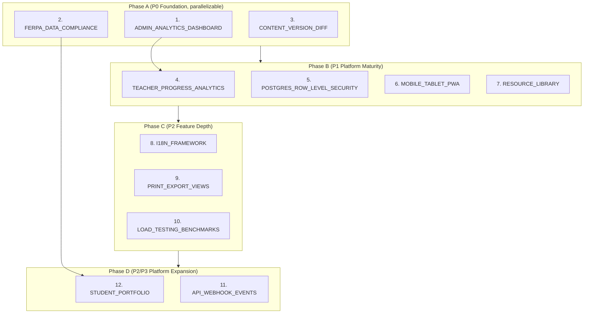

# CODEX Batch 6 — Prioritized Execution Plan

**Date:** 2026-02-17
**Prerequisite:** All Batch 1–5 specs executed (56 total)
**Focus:** Measurement, compliance, content maturity, and platform scale

---

## Completed Batches Summary

### Batch 1 (V0 Build) — 6 specs
Google Integrations, AI Gateway, Institutional Hardening, test fixes, coverage, gap analysis.

### Batch 2 (Feature + Quality) — 17 specs
Analytics, standards, SAML, streaming, LTI, accessibility, hardening, UX depth, testing, polish, CI/CD.

### Batch 3 (Hardening + Integration) — 7 specs
RBAC Wave 2, auth sessions, schema/CI fixes, AI product integration, contract expansion, add-on UX, E2E tests.

### Batch 4 (Architecture + Workflow) — 11 specs
Calendar API, lesson PDF, AI apply-to-plan, student progress, Postgres FTS, form library, SWR data fetching, E2E Playwright, OpenAPI sync, observability/runbooks, shared UI package.

### Batch 5 (Production Readiness + Expansion) — 15 specs
Migration cleanup, data model reconciliation, gradebook depth, middleware auth, production env, performance, notifications, network resilience, Drive depth, bulk ops, onboarding, guardian portal, academic year rollover, workflow validation, district admin.

---

## Batch 6 Execution Plan

### Execution Order and Dependencies

```
Phase A (P0, No Dependencies — Run First)
  1. CODEX_ADMIN_ANALYTICS_DASHBOARD    P0  Medium  [no deps]
  2. CODEX_FERPA_DATA_COMPLIANCE        P0  Medium  [no deps]
  3. CODEX_CONTENT_VERSION_DIFF         P0  Small   [no deps]

Phase B (P1, After Phase A Completes)
  4. CODEX_TEACHER_PROGRESS_ANALYTICS   P1  Medium  [depends on #1]
  5. CODEX_POSTGRES_ROW_LEVEL_SECURITY  P1  Medium  [no deps]
  6. CODEX_MOBILE_TABLET_PWA            P1  Medium  [no deps]
  7. CODEX_RESOURCE_LIBRARY             P1  Medium  [no deps]

Phase C (P2, After Phase B Completes)
  8. CODEX_I18N_FRAMEWORK               P2  Medium  [no deps]
  9. CODEX_PRINT_EXPORT_VIEWS           P2  Small   [no deps]
 10. CODEX_LOAD_TESTING_BENCHMARKS      P2  Medium  [no deps]

Phase D (P2/P3, After Phase C Completes)
 11. CODEX_API_WEBHOOK_EVENTS           P2  Medium  [no deps]
 12. CODEX_STUDENT_PORTFOLIO            P3  Large   [depends on #2]
```

### Dependency Graph



---

### Phase A — P0 Foundation (Run First, Parallelizable)

| # | Spec | Priority | Effort | Why Now |
|---|------|----------|--------|---------|
| 1 | CODEX_ADMIN_ANALYTICS_DASHBOARD | P0 | Medium (6–8h) | PRD-8 defines success metrics but no dashboards to measure them; "Report" nav section is thin |
| 2 | CODEX_FERPA_DATA_COMPLIANCE | P0 | Medium (6–8h) | FERPA/COPPA compliance is non-negotiable for US K-12 schools; no data export or deletion capability exists |
| 3 | CODEX_CONTENT_VERSION_DIFF | P0 | Small (3–4h) | Versioning exists for units, lessons, templates, and now questions — but no way to see what changed between versions |

**Parallelization:** Items 1–3 have no interdependencies. All 3 can execute simultaneously.

---

### Phase B — P1 Platform Maturity

| # | Spec | Priority | Effort | Why Now |
|---|------|----------|--------|---------|
| 4 | CODEX_TEACHER_PROGRESS_ANALYTICS | P1 | Medium (6–8h) | Teachers need student engagement data, at-risk indicators, completion funnels beyond raw gradebook |
| 5 | CODEX_POSTGRES_ROW_LEVEL_SECURITY | P1 | Medium (6–8h) | TECH_SPEC §2.3 explicitly lists RLS as a later-phase item; defense-in-depth for multi-tenancy |
| 6 | CODEX_MOBILE_TABLET_PWA | P1 | Medium (6–8h) | K-12 schools are heavily iPad/tablet; no PWA manifest, touch optimization, or responsive refinements |
| 7 | CODEX_RESOURCE_LIBRARY | P1 | Medium (6–8h) | TECH_SPEC §2.4 lists resource_links; no central file/resource management across units and courses |

**Parallelization:** Items 4–7 can run in parallel. Item 4 depends on #1 completing first.

---

### Phase C — P2 Feature Depth

| # | Spec | Priority | Effort | Why Now |
|---|------|----------|--------|---------|
| 8 | CODEX_I18N_FRAMEWORK | P2 | Medium (6–8h) | Diverse school populations need multi-language support; scaffolding now avoids costly retrofit later |
| 9 | CODEX_PRINT_EXPORT_VIEWS | P2 | Small (3–4h) | Teachers print lesson plans, report cards, gradebooks; no print-optimized views exist |
| 10 | CODEX_LOAD_TESTING_BENCHMARKS | P2 | Medium (6–8h) | No proof the platform handles school-scale traffic; need benchmarks before wider rollout |

---

### Phase D — P2/P3 Platform Expansion

| # | Spec | Priority | Effort | Why Now |
|---|------|----------|--------|---------|
| 11 | CODEX_API_WEBHOOK_EVENTS | P2 | Medium (6–8h) | External systems need event notifications; currently only inbound integrations (OneRoster, LTI) |
| 12 | CODEX_STUDENT_PORTFOLIO | P3 | Large (10–14h) | Student work showcase for parent conferences and college readiness; depends on data compliance |

---

## Key Context for Codex Execution

After Batch 5, the codebase now has:
- **SWR data fetching** — All pages use `useSWR` hooks; new pages should follow this pattern
- **Shared UI package** — `@k12/ui` has Button, Input, Modal, etc.; new pages should import from `@k12/ui`
- **Form library** — `apps/web/src/components/forms/` has FormField, TextInput, Select, etc.
- **E2E Playwright** — `apps/web/e2e/` has test infrastructure; new features should add E2E tests
- **Full-text search** — Postgres FTS with tsvector + GIN indexes on 6 tables
- **Observability** — Structured JSON logging, MetricsService, job instrumentation, runbooks
- **OpenAPI** — All ~100 endpoints documented in `core-v1.openapi.yaml`
- **Bulk operations** — BatchActionBar, BulkGrades, CSV imports; use these patterns for new bulk features
- **Notification channels** — Email delivery, preferences, digests; new notifications should use NotificationService
- **Network resilience** — ConnectionBanner, RetryError, SWR retry config; new pages get resilience for free
- **Guardian links** — guardian_links table connects parents to students; guardian portal pages exist
- **Permissions table** — Admin-configurable fine-grained RBAC via PermissionCheckable concern
- **Academic year rollover** — Term management, archiving, enrollment reset workflows exist
- **Middleware auth** — Server-side route protection via Next.js middleware; new pages are protected automatically

New specs should leverage these patterns rather than reimplementing them.

---

## Total Effort Estimate

| Phase | Specs | Estimated Hours |
|-------|-------|-----------------|
| A | 3 | 15–20h |
| B | 4 | 24–32h |
| C | 3 | 15–20h |
| D | 2 | 16–22h |
| **Total** | **12** | **70–94h** |
