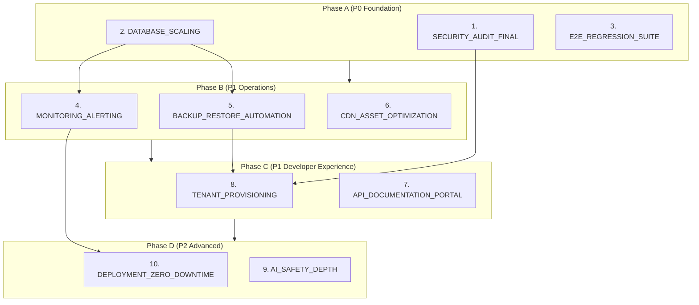

# CODEX Batch 7 — Prioritized Execution Plan

**Date:** 2026-02-17
**Prerequisite:** All Batch 1–6 specs executed (68 total)
**Focus:** Launch readiness — security, scale, operations, and developer experience

---

## Completed Batches Summary

| Batch | Focus | Specs |
|-------|-------|-------|
| 1 | V0 Build | 6 |
| 2 | Feature + Quality | 17 |
| 3 | Hardening + Integration | 7 |
| 4 | Architecture + Workflow | 11 |
| 5 | Production Readiness + Expansion | 15 |
| 6 | Measurement, Compliance, Content, Scale | 12 |
| **Total** | | **68** |

### Platform State After Batch 6

The platform is **feature-complete** across all 7 PRD phases with deep implementations. Key capabilities added in Batch 6:
- Admin analytics dashboards measuring all PRD-8 success metrics
- FERPA/COPPA compliance (data export, deletion, consent tracking)
- Version diff/history/rollback for all versioned content
- Teacher progress analytics (engagement scoring, at-risk early warning)
- Postgres Row-Level Security on all tenant-scoped tables
- Mobile/tablet PWA (manifest, service worker, responsive AppShell)
- Central resource library with folders, tags, and polymorphic attachment
- I18n framework scaffolded (next-intl, locale switcher, RTL foundation)
- Print-friendly views for lesson plans, gradebooks, report cards
- K6 load testing framework with 6 school-realistic scenarios
- Outbound webhook system (20 event types, HMAC signing, retry logic)
- Student portfolio (entries, reflections, standards mastery, guardian sharing)

### What's Missing for Launch

The platform has features but needs **operational confidence**:
1. No comprehensive security audit since Batch 3 hardening
2. Database not optimized for multi-school concurrent load
3. No production alerting beyond Sentry error tracking
4. No automated backup verification (documented but untested)
5. No CDN or asset optimization for global school networks
6. No developer-facing API documentation portal
7. No automated tenant provisioning for new schools
8. AI safety relies on regex filters — no content classification
9. No zero-downtime deployment strategy
10. E2E test coverage doesn't cover all 5 PRD key workflows

---

## Batch 7 Execution Plan

### Execution Order and Dependencies

```
Phase A (P0, No Dependencies — Run First)
  1. CODEX_SECURITY_AUDIT_FINAL          P0  Medium  [no deps]
  2. CODEX_DATABASE_SCALING              P0  Medium  [no deps]
  3. CODEX_E2E_REGRESSION_SUITE          P0  Medium  [no deps]

Phase B (P1, After Phase A Completes)
  4. CODEX_MONITORING_ALERTING           P1  Medium  [depends on #2]
  5. CODEX_BACKUP_RESTORE_AUTOMATION     P1  Small   [depends on #2]
  6. CODEX_CDN_ASSET_OPTIMIZATION        P1  Medium  [no deps]

Phase C (P1, After Phase B Completes)
  7. CODEX_API_DOCUMENTATION_PORTAL      P1  Medium  [no deps]
  8. CODEX_TENANT_PROVISIONING           P1  Medium  [depends on #1, #5]

Phase D (P2, After Phase C Completes)
  9. CODEX_AI_SAFETY_DEPTH               P2  Medium  [no deps]
 10. CODEX_DEPLOYMENT_ZERO_DOWNTIME      P2  Medium  [depends on #4]
```

### Dependency Graph



---

### Phase A — P0 Launch Blockers (Run First, Parallelizable)

| # | Spec | Priority | Effort | Why Now |
|---|------|----------|--------|---------|
| 1 | CODEX_SECURITY_AUDIT_FINAL | P0 | Medium (6–8h) | No comprehensive audit since Batch 3; must verify before real student data |
| 2 | CODEX_DATABASE_SCALING | P0 | Medium (6–8h) | Analytics queries, gradebook, and progress tracking add heavy DB load; need optimization before multi-school |
| 3 | CODEX_E2E_REGRESSION_SUITE | P0 | Medium (8–10h) | All 5 PRD key workflows must be proven end-to-end before launch |

**Parallelization:** All 3 can execute simultaneously.

---

### Phase B — P1 Operations

| # | Spec | Priority | Effort | Why Now |
|---|------|----------|--------|---------|
| 4 | CODEX_MONITORING_ALERTING | P1 | Medium (6–8h) | Can't run a production school platform without proactive alerting |
| 5 | CODEX_BACKUP_RESTORE_AUTOMATION | P1 | Small (3–4h) | Backup strategy documented but never tested; one corruption event loses all data |
| 6 | CODEX_CDN_ASSET_OPTIMIZATION | P1 | Medium (6–8h) | Schools on slow networks need fast asset delivery; bundle size unchecked |

**Parallelization:** #6 has no deps. #4 and #5 depend on #2 (database work).

---

### Phase C — P1 Developer Experience

| # | Spec | Priority | Effort | Why Now |
|---|------|----------|--------|---------|
| 7 | CODEX_API_DOCUMENTATION_PORTAL | P1 | Medium (6–8h) | External integrators (SIS vendors, webhook consumers) need docs |
| 8 | CODEX_TENANT_PROVISIONING | P1 | Medium (6–8h) | Onboarding each new school is manual; needs automation for scale |

---

### Phase D — P2 Advanced

| # | Spec | Priority | Effort | Why Now |
|---|------|----------|--------|---------|
| 9 | CODEX_AI_SAFETY_DEPTH | P2 | Medium (6–8h) | Regex-only safety filters are insufficient for K-12; need content classification |
| 10 | CODEX_DEPLOYMENT_ZERO_DOWNTIME | P2 | Medium (6–8h) | School hours are sacred; deploys during class cause disruption |

---

## Key Context for Codex Execution

After Batch 6, the codebase now has (in addition to all Batch 5 patterns):
- **Analytics services** — AnalyticsAggregationService, CourseAnalyticsService; reuse for new reporting
- **FERPA compliance** — StudentDataExportService, StudentDataDeletionService, ConsentRecord; follow patterns for data handling
- **Version diff** — VersionDiffService, VersionHistoryPanel; content versioning is complete
- **Engagement scoring** — StudentEngagementService, AtRiskDetectionService; follow weighted scoring pattern
- **Postgres RLS** — current_tenant_id() GUC, RlsBypass module; all new tables must have RLS policies
- **PWA** — Service worker, manifest, responsive breakpoints; mobile is covered
- **Resource library** — Resource model with HasResources concern; attach files to any model
- **I18n** — next-intl configured; new pages should use useTranslations()
- **Print views** — PrintLayout, PrintButton; new printable content follows pattern
- **Load tests** — K6 scenarios in apps/load-tests; new features should add load scenarios
- **Webhooks** — WebhookDispatcher.dispatch(); new model events should dispatch
- **Portfolio** — Portfolio model with entries, standards, comments; student work showcase complete

---

## Total Effort Estimate

| Phase | Specs | Estimated Hours |
|-------|-------|-----------------|
| A | 3 | 20–26h |
| B | 3 | 15–20h |
| C | 2 | 12–16h |
| D | 2 | 12–16h |
| **Total** | **10** | **59–78h** |
