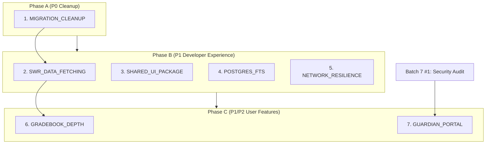

# CODEX Batch 8 — Technical Debt + Post-Launch Features

**Date:** 2026-02-25
**Prerequisite:** All Batch 1–7 specs executed (78 total)
**Focus:** Code quality, developer experience, user-facing depth — not new features

---

## Platform State After Batch 7

Batch 7 delivers **operational confidence**:
- Security audit complete (Brakeman, bundle-audit, RLS verified)
- Database optimized (PgBouncer, read replicas, counter caches, materialized views)
- All 5 PRD workflows proven E2E via Playwright regression suite
- Proactive monitoring and alerting (SystemHealthService, AlertEvaluationJob, SlackNotifier)
- Automated backup with verification (DatabaseBackupJob, BackupVerificationJob)
- CDN-accelerated asset delivery, lazy-loaded heavy components
- API documentation portal for external integrators
- Automated tenant provisioning (no more manual school onboarding)
- ML-based AI safety filters (SafetyPipeline, PIIFilter, ContentClassifier)
- Zero-downtime deployment (blue-green, rollback, deploy windows, FeatureFlag)

**The platform is live with real school customers. Batch 8 improves it.**

---

## What's Still Missing After Batch 7

After launch, these gaps affect developer velocity and user experience:

1. **Duplicate migrations (7 files)** — 20260216 duplicates of 20260215 migrations clutter the migration history and confuse new dev setup
2. **No data fetching layer** — Frontend uses raw `useState`/`useEffect` with direct `apiFetch()` calls; no caching, no optimistic updates, no request deduplication, no revalidation
3. **Shared UI package is empty** — `packages/ui` contains only `.gitkeep`; components (Button, Input, Modal, Card, Toast) are duplicated across pages
4. **Shallow full-text search** — GlobalSearch exists but Postgres FTS via `tsvector` is not deeply implemented; search across units, lessons, standards, templates, questions is regex-based
5. **No offline/network error handling** — PWA infrastructure exists (service worker, manifest) but network failures give no user feedback; no retry logic, no offline banner
6. **Gradebook is basic** — Gradebook renders a spreadsheet view but lacks: weighted categories, grade curve, export to CSV, bulk grade entry, missing-work flags
7. **No guardian portal** — PRD-4 marks Parent/Guardian as a secondary user (optional in MVP); the data model includes `guardian_links` in the TECH_SPEC but no frontend or backend implementation exists

---

## Batch 8 Execution Plan

### Execution Order and Dependencies

```
Phase A (Cleanup — No Dependencies — Run First)
  1. CODEX_MIGRATION_CLEANUP       P0  Tiny  [no deps]

Phase B (Developer Experience — After Phase A)
  2. CODEX_SWR_DATA_FETCHING       P1  Medium  [no deps]
  3. CODEX_SHARED_UI_PACKAGE       P1  Medium  [no deps]
  4. CODEX_POSTGRES_FULL_TEXT_SEARCH  P1  Medium  [no deps]
  5. CODEX_NETWORK_RESILIENCE      P1  Small   [no deps]

Phase C (User-Facing Features — After Phase B)
  6. CODEX_GRADEBOOK_DEPTH         P1  Medium  [depends on #2]
  7. CODEX_GUARDIAN_PORTAL         P2  Large   [depends on Batch 7 #1 Security Audit]
```

### Dependency Graph



---

### Phase A — Cleanup (P0, Run First)

| # | Spec | Priority | Effort | Why Now |
|---|------|----------|--------|---------|
| 1 | CODEX_MIGRATION_CLEANUP | P0 | Tiny (1–2h) | 7 duplicate migration files confuse `db:migrate` and make CI schema verification unreliable; fix before onboarding new engineers |

**Parallelization:** Only one task; no parallelization needed.

---

### Phase B — Developer Experience (P1, After Phase A)

| # | Spec | Priority | Effort | Why Now |
|---|------|----------|--------|---------|
| 2 | CODEX_SWR_DATA_FETCHING | P1 | Medium (8–10h) | Raw `useState`/`useEffect` causes waterfall requests, stale data, and no optimistic updates; hurts UX especially on slow school networks |
| 3 | CODEX_SHARED_UI_PACKAGE | P1 | Medium (10–12h) | `packages/ui` is empty; Button/Input/Modal/Card/Toast each duplicated 5+ times across pages; slows UI bug fixes and redesigns |
| 4 | CODEX_POSTGRES_FULL_TEXT_SEARCH | P1 | Medium (6–8h) | Teachers cannot effectively find units, standards, or questions; search is the #1 teacher workflow after curriculum planning |
| 5 | CODEX_NETWORK_RESILIENCE | P1 | Small (4–6h) | Schools have unreliable WiFi; no network error feedback causes silent data loss (submissions, grades) and teacher frustration |

**Parallelization:** Tasks 2–5 are independent. All four may execute simultaneously.

---

### Phase C — User-Facing Features (After Phase B)

| # | Spec | Priority | Effort | Why Now |
|---|------|----------|--------|---------|
| 6 | CODEX_GRADEBOOK_DEPTH | P1 | Medium (6–8h) | Teachers at launch will request: weighted grade categories, bulk entry, CSV export, missing-work auto-flag; without these, teachers fall back to spreadsheets |
| 7 | CODEX_GUARDIAN_PORTAL | P2 | Large (12–16h) | Parent visibility is an administrator expectation; schools frequently require guardian access as a condition of adoption |

**Parallelization:** Task 6 depends on Task 2 (SWR). Task 7 is independent but large.

---

## Key Context for Codex Execution

After Batch 7, the codebase will have (in addition to all Batch 1–6 patterns):
- **SWR** — Once Task 2 is done, all subsequent pages should use `useSWR()` / `useSWRMutation()` for data fetching instead of raw `apiFetch()` with `useState`
- **Shared UI** — Once Task 3 is done, use `@k12/ui` components (`Button`, `Input`, `Modal`, `Card`, `Toast`) instead of inline implementations
- **RLS** — Any new model created in Batch 8 must follow the RLS migration pattern from Batch 7 Task 1
- **FeatureFlag** — The `FeatureFlag` model from Batch 7 Task 10 can be used to gate Batch 8 features during rollout
- **TenantProvisioning** — The `OnboardingChecklistService` from Batch 7 Task 8 should be updated when new capabilities (guardian portal, gradebook depth) go live to add them as optional checklist items

---

## Total Effort Estimate

| Phase | Specs | Estimated Hours |
|-------|-------|-----------------|
| A | 1 | 1–2h |
| B | 4 | 28–36h |
| C | 2 | 18–24h |
| **Total** | **7** | **47–62h** |

---

## Definition of Batch 8 Complete

Batch 8 is complete when all of the following are true:
- [x] `db/migrate/` contains no duplicate migration files; `bundle exec rails db:migrate:status` shows all UP with no gaps
- [x] All frontend pages that fetch data use SWR hooks; no page uses raw `useState`/`useEffect` for server data
- [x] `packages/ui` exports Button, Input, Modal, Card, Toast, Badge, Spinner, Skeleton; all in-app duplicates removed
- [x] Full-text search returns results for units, lessons, standards, templates, and questions via `tsvector`-indexed columns
- [x] Offline banner appears within 2 seconds of network loss and auto-clears on reconnect; failed mutations auto-retry
- [x] Gradebook supports weighted categories, grade curve, CSV export, bulk entry, and missing-work flags
- [x] Guardian portal allows parents to view linked students' grades, assignments, and announcements
- [x] All specs pass: `bundle exec rspec`, `npm run typecheck`, `npm run lint`, `pytest`
- [x] No regressions from Batch 7 (E2E suite still passes)
